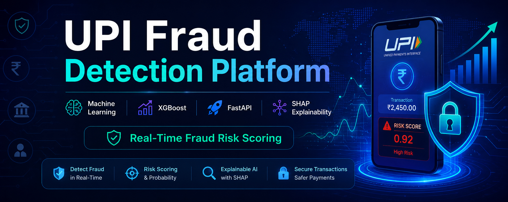

 




# UPI Fraud Detection System

A real-time, explainable machine-learning system for detecting fraudulent UPI (Unified Payments Interface) transactions. Built as a final-year major project, it combines an XGBoost classifier with SHAP-based explainability and a 0–100 risk-scoring engine to flag suspicious digital payments as they happen.

**🔗 Live Dashboard (frontend):** [fraud-dashboard](https://github.com/Harshit786zs/fraud-dashboard) — React dashboard with live transaction feed, Razorpay test-mode payment simulation, and model analytics.

## Overview

This system uses an XGBoost classifier along with engineered transaction features to detect suspicious payment patterns in real time. Every prediction comes with a SHAP-based explanation of *why* the model flagged it, and a risk score (0–100) that maps to actionable tiers for downstream systems.

## Features

- Real-time fraud prediction via REST API
- XGBoost classifier — **97.94% ROC-AUC**
- SHAP explainability — per-transaction feature attribution for every prediction
- Dynamic 0–100 risk scoring with three tiers:
  - **LOW** — score ≤ 30
  - **MEDIUM** — score ≤ 55
  - **HIGH** — score > 55
- High-value transaction detection
- Night-time transaction monitoring
- FastAPI REST API with auto-generated docs
- Model performance comparison across algorithms

## Tech Stack

- Python
- FastAPI
- XGBoost
- SHAP
- Scikit-learn
- Pandas / NumPy
- Joblib

## Machine Learning Models

| Model               | ROC-AUC |
| -------------------- | ------- |
| Logistic Regression | 96.34%  |
| Random Forest        | 96.07%  |
| **XGBoost**           | **97.94%**  |

XGBoost achieved the best performance and was selected for deployment.

## Risk Scoring

Each transaction receives a risk score from 0–100, derived from the model's fraud probability plus weighted business rules (transaction amount, time-of-day, velocity). Scores map to three response tiers:

| Score Range | Tier   | Suggested Action       |
| ----------- | ------ | ----------------------- |
| 0 – 30      | LOW    | Allow                   |
| 31 – 55     | MEDIUM | Flag for review         |
| 56 – 100    | HIGH   | Block / step-up auth    |

## API Endpoints

### `GET /`
Returns API status.

### `GET /health`
Checks API health.

### `GET /stats`
Displays model performance metrics.

### `POST /predict`
Predicts fraud probability, generates a risk score, and returns SHAP-based feature explanations for a transaction.

Once running, interactive API docs are available at `http://localhost:8000/docs`.

## Project Workflow

1. Data Collection
2. Data Preprocessing
3. Feature Engineering
4. Model Training
5. Model Evaluation
6. Risk Scoring
7. SHAP Explainability Integration
8. API Deployment with FastAPI

## Installation

```bash
git clone https://github.com/Harshit786zs/Upi_Fraud_Detection.git
cd Upi_Fraud_Detection

python -m venv venv
venv\Scripts\activate        # Windows
# source venv/bin/activate   # macOS/Linux

pip install -r requirements.txt

uvicorn src.api.main:app --reload --port 8000
```

The API will be live at `http://localhost:8000`, with interactive docs at `http://localhost:8000/docs`.

## Frontend Dashboard

A companion React + Vite dashboard consumes this API and provides:
- Live transaction feed with real-time fraud flags
- A "Pay" tab with QR code generation and Razorpay test-mode checkout
- Model analytics, transaction history, and a personal UPI profile

See the [fraud-dashboard repo](https://github.com/Harshit786zs/fraud-dashboard) for setup instructions.

## Future Enhancements

- Power BI / advanced analytics dashboard
- Real-time streaming detection (Kafka/WebSockets)
- Geo-location risk analysis
- Cloud deployment

## Author

**Harshit Choudhary**
[GitHub](https://github.com/Harshit786zs)

## License

This project is licensed under the MIT License — see the [LICENSE](LICENSE) file for details.
